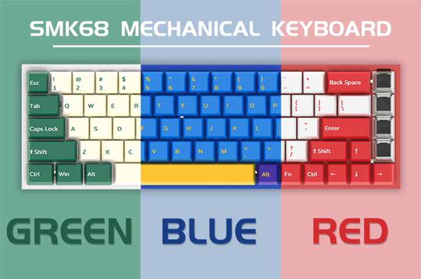
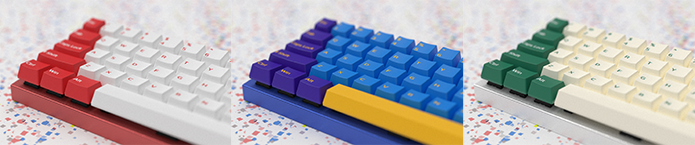

sipeed_keyboard
====


sipeed opensource mechanical keyboard(SMK) made with BL706

矽π 开源双模机械键盘




## 特性

* 主控使用 BL706， 使用 `RISC-V` 核， 支持蓝牙和 `USB`，[代码开源](https://github.com/Sipeed/sipeed_keyboard)


## 目录结构

```
./
├── LICENSE
├── README.md
├── firmware // 存放键盘固件
├── hardware // 硬件设计
├── software // 上位机软件
├── teamworks // 贡献记录
└── tools // 工具
```

## 构建键盘固件

* 参考[开发环境搭建指南](http://bouffalolab.gitee.io/bl_mcu_sdk/get_started/index.html)

* 克隆仓库到本地（需要更新子模块）

```sh
git clone https://github.com/sipeed/sipeed_keyboard.git
cd sipeed_keyboard
git submodule init
git submodule update
```

* 编译固件

```
cd firmware/bl_mcu_sdk
make build BOARD=sipeed_keyboard APP=sipeed_keyboard_68 APP_DIR=../keyboard
```

* 烧录固件到键盘

根据 [开发环境搭建指南](http://bouffalolab.gitee.io/bl_mcu_sdk/get_started/index.html) 里面所述进行烧录

> 以 Linux 为例:
> * 按住键盘的 <kbd>BOOT</kbd> 按键
> * 然后按 <kbd>RESET</kbd> 按键
> * 片刻后松开两个按键(松开不论顺序)
> * 使用`ls /dev/tty*` 命令查看到出现的串口设备，比如叫`/dev/ttyACM0`
> * 然后再`firmware/bl_mcu_sdk`目录下执行烧录命令
> ```
> make download INTERFACE=uart COMx=/dev/ttyACM0
> ```

烧录结束后需要手动按一下 <kbd>RESET</kbd> 按键来重启键盘

## 开源证书

代码采用 [Apache 2.0](./LICENSE) 开源协议， 参与贡献后可以在修改的文件头注释标明修改和日期

## 贡献者

<a href="https://github.com/sipeed/sipeed_keyboard/graphs/contributors">
  
</a>


## 参与贡献

* 项目进度可以在 [sipeed_keyboard/projects](https://github.com/sipeed/sipeed_keyboard/projects) 看到， 为领取的任务可以领取一起做~
* 可以发起[issues](https://github.com/sipeed/sipeed_keyboard/issues)，做好了提交 `Pulll Request`
* 可以加 QQ 群参与讨论（ 933963409 ）


